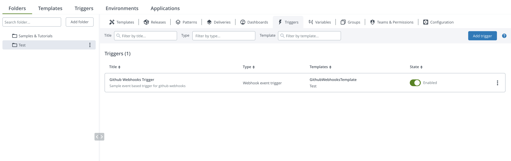
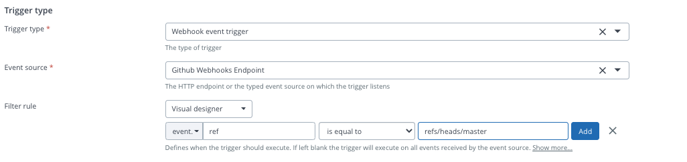

# Xlr-github-webhooks-samples

This repo contains examples of webhooks json requests to XL Release webhooks endpoints.

Please refer to the following links for more information:  
Github docs -> https://developer.github.com/webhooks/event-payloads/#create  
Digita.ai docs -> https://docs.xebialabs.com/v.9.7/release/webhooks/webhooks-overview/.

## 1 - How to set up a HTTP Endpoint for Webhooks
Under *Settings* ->  *Shared Configurations* -> HTTP Endpoint for Webhooks

A Sample configuration would look something like  

## 2 - How to set up a trigger from a folder

Under *Design* -> *Folders* and select folder -> *Triggers*  -> *Add trigger*  

## 3 - Setting up a Github webhook trigger
Once Add trigger is selected you should have a list of trigger types to choose from.  
Select *webhook event trigger* as trigger type and select the event source created on step 1.

Fill in other fields as needed.
### 3a - Features for trigger set ups
Select a filter rule from the drop down list in order to filter requests to this trigger.
Under visual design a rule set up would look something like: 
By creating this rule this trigger would only be triggered when the event.ref would be equals to the specified ref in request from github.
e.g the json request would look something like
 ```
{
  "ref": "refs/heads/master",      <-------
  "before": "958fb9525db170a4044f23429caea13603a4666a",
  "after": "48303e0898c591765c7b839d99f73f98f84eca80",
  "repository": {"some data here"},
  "pusher": {"some data here"},
  "organization": {"some data here"},
  "sender": {"some data here"},
  "created": false,
  "deleted": false,
  "forced": false,
  "base_ref": null,
  "compare": "https://github.com/xebialabs-community/xlr-github-webhooks-samples/compare/958fb9525db1...48303e0898c5",
  "commits": [{"some data here"}],
  "head_commit": {"some data here"}
}
``` 

### 3b - Use elements of json as values for XLR 
Elements of the json request can be used as values for xlr fields as for example: 
