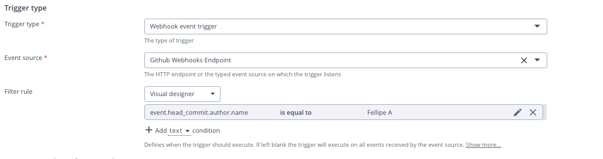
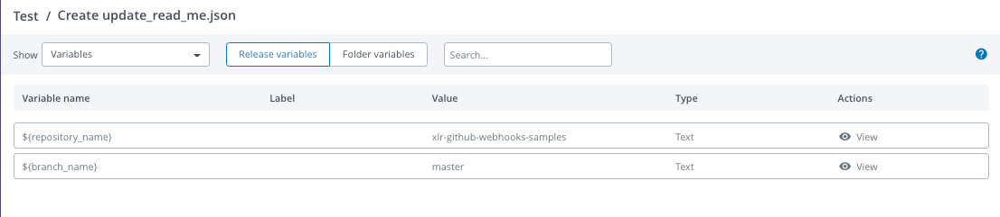
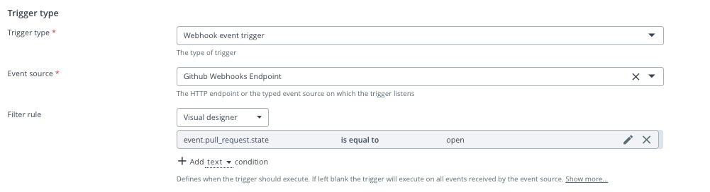
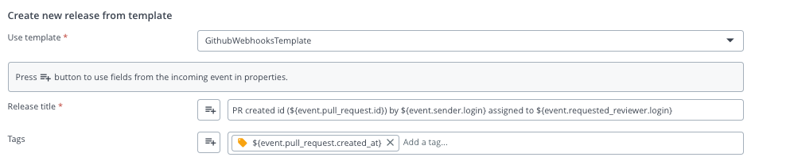
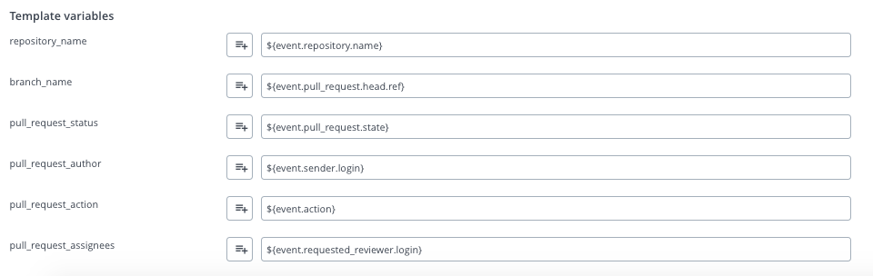
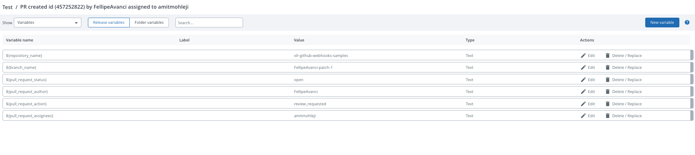

# Xlr-github-webhooks-samples

This repo contains examples of webhooks json requests to XL Release webhooks endpoints.

Please refer to the following links for more information:  
Github docs -> https://developer.github.com/webhooks/event-payloads/#create  
Digita.ai docs -> https://docs.xebialabs.com/v.9.7/release/webhooks/webhooks-overview/.

## 1 - How to set up a HTTP Endpoint for Webhooks
Under *Settings* ->  *Shared Configurations* -> HTTP Endpoint for Webhooks

A Sample configuration would look something like  

## 2 - How to set up a trigger from a folder

Under *Design* -> *Folders* and select folder -> *Triggers*  -> *Add trigger*  

## 3 - Setting up an XLR webhook trigger (Github event type -> PUSH)
Once Add trigger is selected you should have a list of trigger types to choose from.  
Select *webhook event trigger* as trigger type and select the event source created on step 1.

Fill in other fields as needed.
### Features for trigger set ups
Select a filter rule from the drop down list in order to filter requests to this trigger.
Under visual design a rule set up would look something like: 
By creating this rule this trigger would only be triggered when the author of the push event would be equal to the specified name passed.
e.g the json request would look something like
 ```
{
  "ref": "refs/heads/master",      
  "before": "958fb9525db170a4044f23429caea13603a4666a",
  "after": "48303e0898c591765c7b839d99f73f98f84eca80",
  "repository": {
     "id": 282020003,
     "name": "xlr-github-webhooks-samples"
  },
  "pusher": {"some data here"},
  "organization": {"some data here"},
  "sender": {"some data here"},
  "created": false,
  "deleted": false,
  "forced": false,
  "base_ref": null,
  "compare": "https://github.com/xebialabs-community/xlr-github-webhooks-samples/compare/958fb9525db1...48303e0898c5",
  "commits": [{"some data here"}],
  "head_commit": {
      "id": "73f61ed97706a0b1d11e79f6068aba1eb7d271f7",
      "tree_id": "25bfab4034050d22f92fcae87339b5dc5261b6ac",
      "distinct": true,
      "message": "Create update_read_me.json",
      "timestamp": "2020-07-23T14:02:10-04:00",
      "url": "https://github.com/xebialabs-community/xlr-github-webhooks-samples/commit/73f61ed97706a0b1d11e79f6068aba1eb7d271f7",
      "author": {
        "name": "Fellipe A",     <-------- Author matches filter
        "email": "*****@gmail.com",
        "username": "FellipeAvanci"
      },
      "committer": {
        "name": "GitHub",
        "email": "noreply@github.com",
        "username": "web-flow"
      },
      "added": [
        "update_read_me.json"
      ],
      "removed": [
  
      ],
      "modified": [
  
      ]
    }
}
``` 

### Use elements of json as values for XLR 
Elements of the json request can be used as values for xlr fields as for example: 


### Use Template variables 
Template variables can be filled based on trigger event data as for example:  


This is the template after execution (push trigger) variables and release title reflecting data from json push event.



## 4 - Setting up an XLR webhook trigger (Github event type -> PULL REQUEST)
### Features for trigger set ups
Trigger type with Pull request filter example: 
Pull request trigger will only be executed if action is 'open'.


### Use elements of json as values for XLR 
Release form with pull request example: 
Release title built with elements from json.


### Use Template variables 
Release variables with pull request example:


Template after pull request trigger execution
Title is formed correctly and variables populated for example: 
