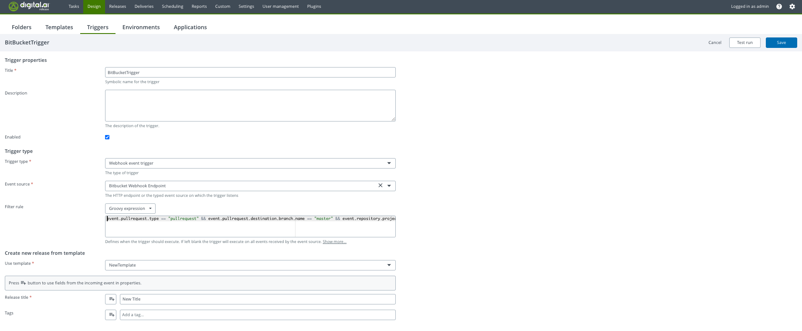

# Bitbucket Webhook Sample

This sample integration showcases Release triggers for Bitbucket *pull request* and *push* webhook events.

The preferred approach of using this sample is by applying the `webhook-integration.yaml` as-code template as described
in the main README file.

After applying the YAML file you can test it using the `Test run` feature on the trigger configuration page.

Pull request events can be tested using `pull_request.json`.

Push events can be tested using `push_request.json`.

The sample YAML file will configure the following objects in Release under the *Webhook Samples* folder:
 - Single endpoint for all events from Bitbucket accessible from **http://&lt;xlr-address&gt;/webhooks/bitbucket-sample-webhook**
 - Trigger to handle push events
   - This trigger has been configured to use the visual rule editor.  It checks the headers from the event to ensure
     it is executed only for push events.  It checks the event payload to ensure it is only executed when pushing to the
     master branch of the xlr-webhooks-sample repository.
 - Trigger to handle merge request events
   - This trigger has been configured to use the groovy rule editor which allows for more complex conditions. It checks
     the headers from the event to ensure it is executed only for pull request created events. It checks the event payload to
     ensure it is only executed when:
        - The pull request is created
        - It is for project test-project
        - It is merging into the master branch of the xlr-webhooks-sample repository
 - Template that both triggers use to create releases with a number of release variables that will be populated by the
   triggers

## Configure Bitbucket to send webhook events to Digitial.AI Release

In Bitbucket go to the repository you want to enable the webhook events for and navigate to Repository settings > Webhooks 

Click "Add webhook"

For the URL use the endpoint created in Release, in this case **http://&lt;xlr-address&gt;/webhooks/Bitbucket-sample-webhook**.

Then choose the events you want send, in this case *Repository: Push* and *Pull Request: Created*.

Then click on *Save*.  Now the webhook is enabled and should send any of your selected event types to the
endpoint configured in Release.

More information can be found in the [Bitbucket documentation](https://support.atlassian.com/bitbucket-cloud/docs/manage-webhooks/).

### Troubleshooting webhooks from Bitbucket

Information regarding trouble shooting webhooks from Bitbucket can be found [here](https://support.atlassian.com/bitbucket-cloud/docs/troubleshoot-webhooks/)

## Customizing the YAML file for your environment

The sample here works in a Bitbucket environment configured with:
 * repository *xlr-webhooks-samples*
 * branch *master*
 * project *test-project*

Look for those values in the YAML file and adjust according to your environment.

###Creating Sample trigger using XLR UI

