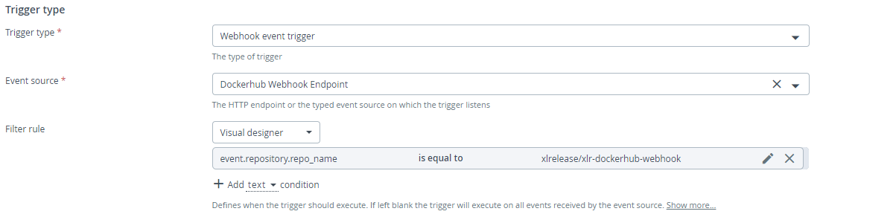

# Dockerhub Webhook Sample

This sample integration showcases Release triggers for Dockerhub `push` webhook events.

The preferred approach of using this sample is by applying the `webhook-integration.yaml` as-code template as described in the main README file.

If you wish to create and configure the triggers and event source manually, please see the following setup instructions.

## Event source setup

Under Design->Folder->Configuration click '+' next to Webhooks and Events->HTTP Endpoint For Webhooks.

Select "POST endpoint" as HTTP Endpoint for Webhooks.

If you want to enable authentication for select "Scripted Authenrication (Jython)" for Authentication Method and enter the following inforation
int the Authenrication Script:

		global parameters

		def get_tokens():
			return parameters['token'].split(', ') if 'token' in parameters else []

		# True if the 'token' query parameter exists and one of its values matches 's3cr3t'
		authenticated = 's3cr3t' in get_tokens()
		
		*** Note this configuration would require the configured webhook in the Dockerhub confige would send the query parameter token=s3cr3t

Example of HTTP Webhook Endpoint with no authentication: 

Example of HTTP Webhook Endpoint with authentication: 

Fill in other fields as needed.

### Manual trigger setup

Select *Webhook event trigger* as trigger type and select the event source created.

Fill in other fields as needed.

#### Dockerhub Push Trigger

##### Filter rule

Select a filter rule from the drop down list in order to restrict events on which this trigger will fire.

Example of a `Visual designer` filter: 

With this rule in place, the trigger will only fire when the push is made to the `xlrelease/xlr-dockerhub-webhook` repository. 

Example Dockerhub `push` event which would satisfy the filter rule:

```
{
    "push_data": {
        "pushed_at": 1604678260,
        "images": [],
        "tag": "latest",
        "pusher": "xlr-dev"
    },
    "callback_url": "https://registry.hub.docker.com/u/xlrelease/xlr-dockerhub-webhook/hook/21d54a2gagcfd41fffj32h53201ffii5g/",
    "repository": {
        "status": "Active",
        "description": "Repository to demonstrate Dockerhub webhook integration",
        "is_trusted": false,
        "full_description": "",
        "repo_url": "https://hub.docker.com/r/xlrelease/xlr-dockerhub-webhook",
        "owner": "xlr-dev",
        "is_official": false,
        "is_private": false,
        "name": "xlr-dockerhub-webhook",
        "namespace": "xlrelease",
        "star_count": 0,
        "comment_count": 0,
        "date_created": 1604673022,
        "repo_name": "xlrelease/xlr-dockerhub-webhook" 	<------ filter checks if push request was to repo xlrelease/xlr-dockerhub-webhook
    }
}
``` 

###### Test procedure for Dockerhub webhook with curl

The following request can be issued with curl to exercise the Dockerhub push webhook with no authentication trigger:

> curl --request POST \
  --url 'http://localhost:5516/webhooks/dockerhub-sample-webhook' \
  --header 'Content-Type: application/json'
  --data '@dockerhub/pull_request.json'
  
The following request can be issued with curl to exercise the Dockerhub push webhook with authentication trigger:

> curl --request POST \
  --url 'http://localhost:5516/webhooks/dockerhub-sample-webhook-auth?token=s3cr3t' \
  --header 'Content-Type: application/json' \
  --data '@dockerhub/pull_request_auth.json'