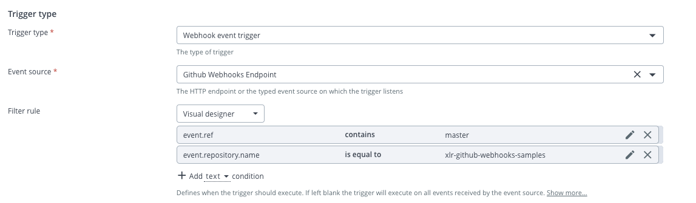
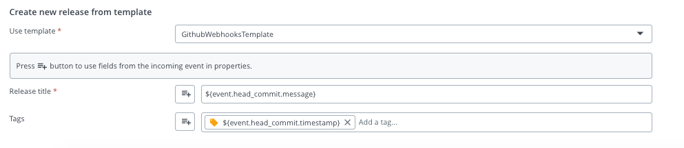
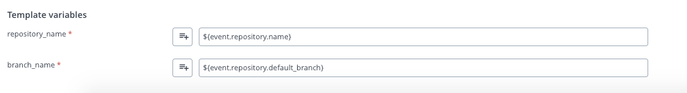
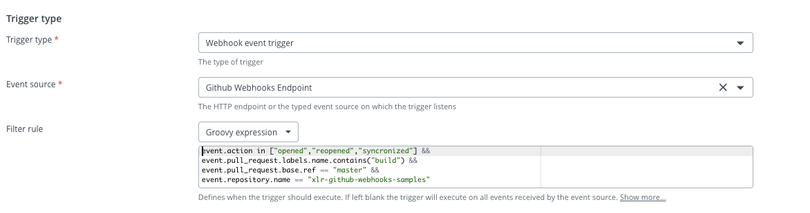
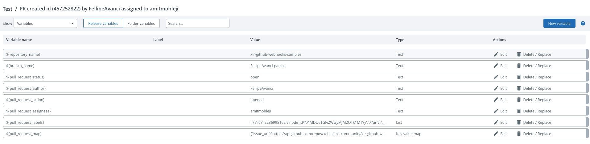

# GitHub Webhook Sample

This sample integration showcases Release triggers for GitHub `pull_request` and `push` webhook events.

The preferred approach of using this sample is by applying the `webhook-integration.yaml` as-code template as described in the main README file.

If you wish to create and configure the triggers manually, please see the following setup instructions.

## Manual trigger setup

Select *Webhook event trigger* as trigger type and select the event source created.

Fill in other fields as needed.

### GitHub Push Trigger

#### Filter rule

Select a filter rule from the drop down list in order to restrict events on which this trigger will fire.

Example of a `Visual designer` filter: 

With this rule in place, the trigger will only fire when the push is made to the `master` branch of the `xlr-github-webhooks-samples` repository. 

Example GitHub `push` event which would satisfy the filter rule:

```
{
  "ref": "refs/heads/master",      <------ filter checks if master is in here
  "before": "958fb9525db170a4044f23429caea13603a4666a",
  "after": "48303e0898c591765c7b839d99f73f98f84eca80",
  "repository": {
     "id": 282020003,
     "name": "xlr-webhooks-samples" <------- filter checks for this name
  },
  "pusher": {"some data here"},
  "organization": {"some data here"},
  "sender": {"some data here"},
  "created": false,
  "deleted": false,
  "forced": false,
  "base_ref": null,
  "compare": "https://github.com/xebialabs-community/xlr-github-webhooks-samples/compare/958fb9525db1...48303e0898c5",
  "commits": [{"some data here"}],
  "head_commit": {
      "id": "73f61ed97706a0b1d11e79f6068aba1eb7d271f7",
      "tree_id": "25bfab4034050d22f92fcae87339b5dc5261b6ac",
      "distinct": true,
      "message": "Create update_read_me.json",
      "timestamp": "2020-07-23T14:02:10-04:00",
      "url": "https://github.com/xebialabs-community/xlr-github-webhooks-samples/commit/73f61ed97706a0b1d11e79f6068aba1eb7d271f7",
      "author": {
        "name": "Fellipe A",    
        "email": "*****@gmail.com",
        "username": "FellipeAvanci"
      },
      "committer": {
        "name": "GitHub",
        "email": "noreply@github.com",
        "username": "web-flow"
      },
      "added": [
        "update_read_me.json"
      ],
      "removed": [
  
      ],
      "modified": [
  
      ]
    }
}
``` 

#### Data mapping

Fields from the incoming JSON event can be mapped directly to release properties like Title and Tags:



Release variables can also be populated from the incoming JSON fields:



After the trigger has fired and the release was created, the properties and variables of the release will contain the data from the incoming GitHub event: 


### GitHub Pull Request Trigger

#### Filter rule

Select a filter rule from the drop down list in order to restrict events on which this trigger will fire.

The Pull Request filter has a more complex logic so here we use a `Groovy expression` filter: 



With this filter in place, the trigger will only fire when the pull request is opened, reopened or when new commits are pushed to the PR. Also, the pull request must have a `build` label and be opened towards the `master` branch of the `xlr-github-webhooks-samples` repository. 

#### Data mapping

Fields from the incoming JSON event can be mapped directly to release properties like Title and Tags:


Release variables can also be populated from the incoming JSON fields:


After the trigger has fired and the release was created, the properties and variables of the release will contain the data from the incoming GitHub event: 

