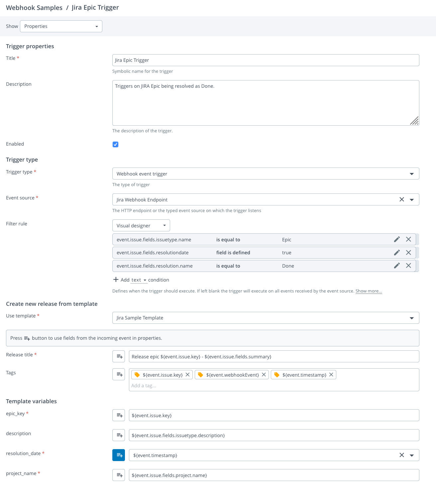

# JIRA Webhook Sample

This sample integration showcases Release triggers for JIRA webhook events.

The preferred approach of using this sample is by applying the `webhook-integration.yaml` as-code template as described in the main README file.

After applying the YAML file you can test it using the `Test run` feature on the trigger configuration page.

The sample integration can be tested using the `issue_updated_event.json`.

The sample YAML file will configure the following objects in Release under the *Webhook Samples* folder:
 - Single endpoint for all events from JIRA accessible from **http://&lt;xlr-address&gt;/webhooks/jira-sample-webhook**
 - Trigger to handle issue updated events
   - This trigger has been configured to use the visual rule editor. It checks the event payload to ensure it is only executed when:
     - The issue type is `Epic`
     - Issue has been closed with `resolution` being `Done`
 - Template that the trigger uses to create releases with a number of release variables that will be populated by the
   trigger
   
## Configure JIRA to send webhook events to Digital.AI Release

To configure JIRA to send events to Digital.AI Release, follow the instructions available on the [JIRA documentation site](https://developer.atlassian.com/server/jira/platform/webhooks/).

For the URL use the endpoint created in Release, in this case **http://&lt;xlr-address&gt;/webhooks/jira-sample-webhook**.

Then choose the events you want send, in this case *Issue Updated* event.

To register the webhook, click Create.

## Creating the trigger manually

