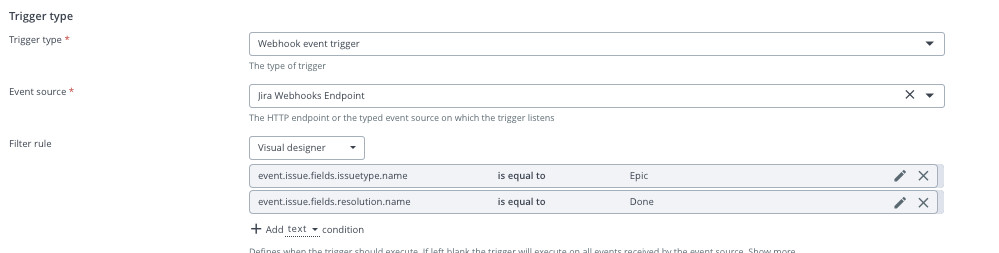
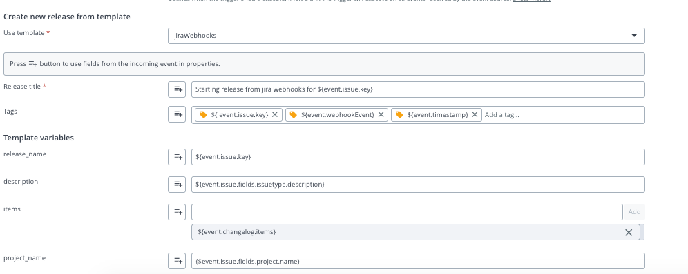
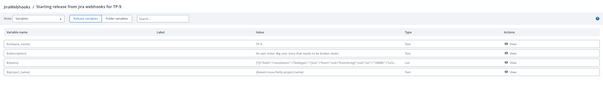

# Jira Webhook Sample

This sample integration showcases Release triggers for Jira webhook events.

The preferred approach of using this sample is by applying the `webhook-integration.yaml` as-code template as described in the main README file.

If you wish to create and configure the triggers manually, please see the following setup instructions.

More information on jira webhooks can be [found here](https://developer.atlassian.com/server/jira/platform/webhooks/).
## Manual trigger setup

Select *Webhook event trigger* as trigger type and select the event source created.

Fill in other fields as needed.

### Jira Trigger

#### Filter rule

Select a filter rule from the drop down list in order to restrict events on which this trigger will fire.

Example of a `Visual designer` filter:   




With this rule in place, the trigger will only fire when the issue type is `Epic` and `resolution` is `Done`.

Example Jira `Epic` event which would satisfy the filter rule:

```
{
  "timestamp": 1597686247698,
  "webhookEvent": "jira:issue_updated",
  "issue_event_type_name": "issue_generic",
  "user": {
    "self": "http://localhost:8081/rest/api/2/user?username=admin",
    "name": "admin",
    "key": "admin",
    "emailAddress": "youremail@test.com",
    "displayName": "admin",
    "active": true,
    "timeZone": "America/New_York"
  },
  "issue": {
    "id": "10200",
    "self": "http://localhost:8081/rest/api/2/issue/10200",
    "key": "TP-9",
    "fields": {
      "issuetype": {
        "self": "http://localhost:8081/rest/api/2/issuetype/10001",
        "id": "10001",
        "description": "Created by Jira Software - do not edit or delete. Issue type for a big user story that needs to be broken down.",
        "iconUrl": "http://localhost:8081/images/icons/issuetypes/epic.svg",
        "name": "Epic", <------
        "subtask": false
      },
      "timespent": null,
      "project": {
        "self": "http://localhost:8081/rest/api/2/project/10000",
        "id": "10000",
        "key": "TP",
        "name": "TestProject"
      },
      "fixVersions": [],
      "aggregatetimespent": null,
      "resolution": {
        "self": "http://localhost:8081/rest/api/2/resolution/10000",
        "id": "10000",
        "description": "Work has been completed on this issue.",
        "name": "Done" <-------
      }
    }
  }
}
``` 

#### Data mapping

Fields from the incoming JSON event and Release variables can be mapped directly to release properties like:




After the trigger has fired and the release was created, the properties and variables of the release will contain the data from the incoming Jira event: 



